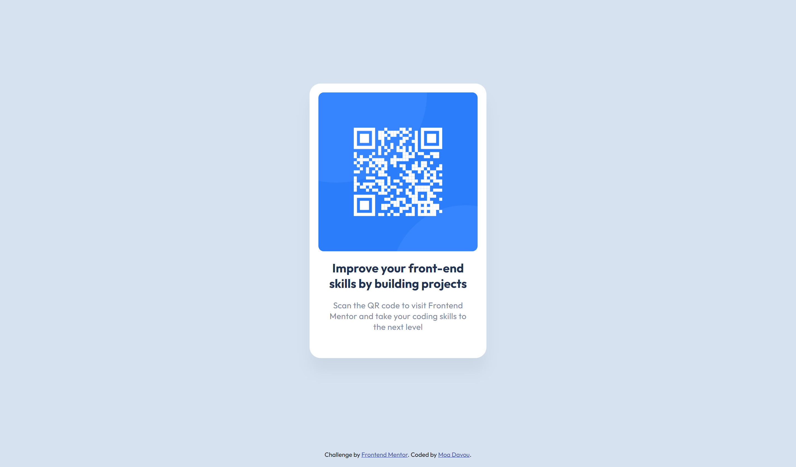

# Frontend Mentor - QR code component solution

This is a solution to the [QR code component challenge on Frontend Mentor](https://www.frontendmentor.io/challenges/qr-code-component-iux_sIO_H). Frontend Mentor challenges help you improve your coding skills by building realistic projects.

## Table of contents

- [Overview](#overview)
  - [Screenshot](#screenshot)
  - [Links](#links)
- [My process](#my-process)
  - [Built with](#built-with)
  - [What I learned](#what-i-learned)
  - [Feedback](#feedback)
  - [Continued development](#continued-development)
- [Author](#author)
- [Acknowledgments](#acknowledgments)

## Overview

### Screenshot



### Links

- Repository URL: [GitHub](https://github.com/moadavou/qr-code-component)
- Live Site URL: [GitHub Pages](https://moadavou.github.io/qr-code-component/)

## My process

### Built with

- Semantic HTML5 markup
- CSS custom properties
- Flexbox
- Mobile-first workflow

### What I learned

This was my first time working with Git and GitHub. Using these tools rendered new challenges for me. I learned how to use the terminal for Git commands, GitHub Desktop, and link responsive files.

My greatest error was using an absolute path to link the QR code image.

```html

```

This worked great with the Live Server Extension in VS Code. But the image wouldn't render on GitHub Pages since the link looked for `images` as a direct child of the root folder. Because of how GitHub hosts, the root folder of the site is not actually the same as the root folder of the repositorie.

```html

```

or...

```html

```

...makes the file path relative (it looks for `images` as a direct child of the current location).

### Feedback

In the feedback I received for this challenge, I was recommended to use `dvh` instead of `vh` for the wrapper. After reading a little bit more about the sections regarding `svh`, `dvh`, and `lvh` I decided on using `vh` in the end.

The reason for this is that I want to avoid the jumping `dvh` can cause on page scroll. For this project, I don't have any elements that need to stay above the fold. So `vh` feels more appropriate than `svh` (but both would probably work fine).

I was recommended to use the **62.5% Font Size Trick** for simpler calculations with rem units. However, after reading about this topic I understood that this trick is not as great as it sounds. [Grace Snow wrote a great article about why.](https://fedmentor.dev/posts/rem-html-font-size-hack/)

### Continued development

I want to continue focusing on working with a mobile-first workflow (I usually do desktop-first), responsiveness and accessibility. Since I'm a beginner, I want to make sure that the basics are good. I also want to continue to work with Git and GitHub, to further develop these skills.

## Author

- Frontend Mentor - [@moadavou](https://www.frontendmentor.io/profile/moadavou)
- GitHub - [@moadavou](https://github.com/moadavou)

## Acknowledgments

[@AlexKMarshall](https://github.com/AlexKMarshall) was very kind and quick in his response when I asked why my QR code image wasn't showing up on GitHub Pages.
